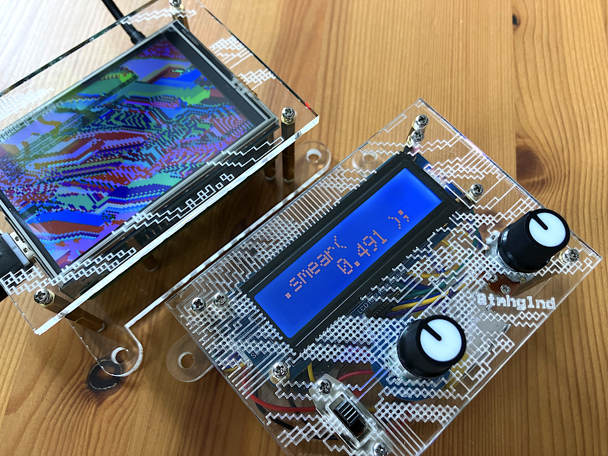

> [!WARNING]
> **Development moved to Codeberg: https://codeberg.org/tmhglnd/abstraction-minified**

# Abstraction Minified

A minified version of the [`.abstraction()`](https://github.com/tmhglnd/abstraction) installation that can be run on a RPi2+ with a small LCD screen and controlled with a self-build wireless controller using for example an ESP32.

## Support my work

# License

The software in this repository is licensed under the [**GNU GPLv3** license](https://choosealicense.com/licenses/gpl-3.0/)

The creative output of this work is licensed under the [**CC BY-SA 4.0** license](https://creativecommons.org/licenses/by-sa/4.0/legalcode)

This is a [**Free Culture License**](https://creativecommons.org/share-your-work/public-domain/freeworks)!

You are free to:

- `Share` — copy and redistribute the material in any medium or format

- `Adapt` — remix, transform, and build upon the material for any purpose, even commercially.

Under the following terms:

- `Attribution` — You must give appropriate credit, provide a link to the license, and indicate if changes were made. You may do so in any reasonable manner, but not in any way that suggests the licensor endorses you or your use.

- `ShareAlike` — If you remix, transform, or build upon the material, you must distribute your contributions under the same license as the original.

This program is distributed in the hope that it will be useful, but WITHOUT ANY WARRANTY; without even the implied warranty of MERCHANTABILITY or FITNESS FOR A PARTICULAR PURPOSE. See the GNU General Public License for more details.

